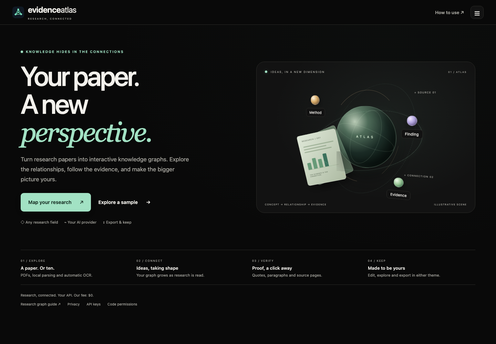
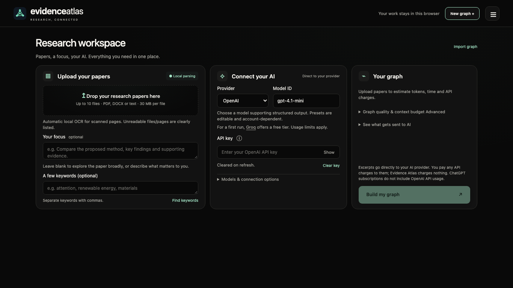
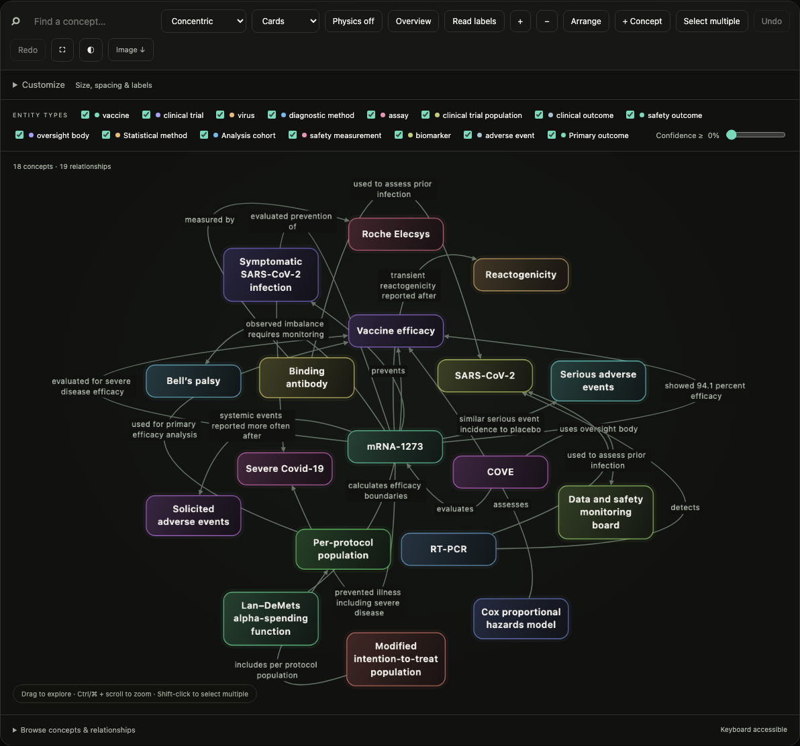
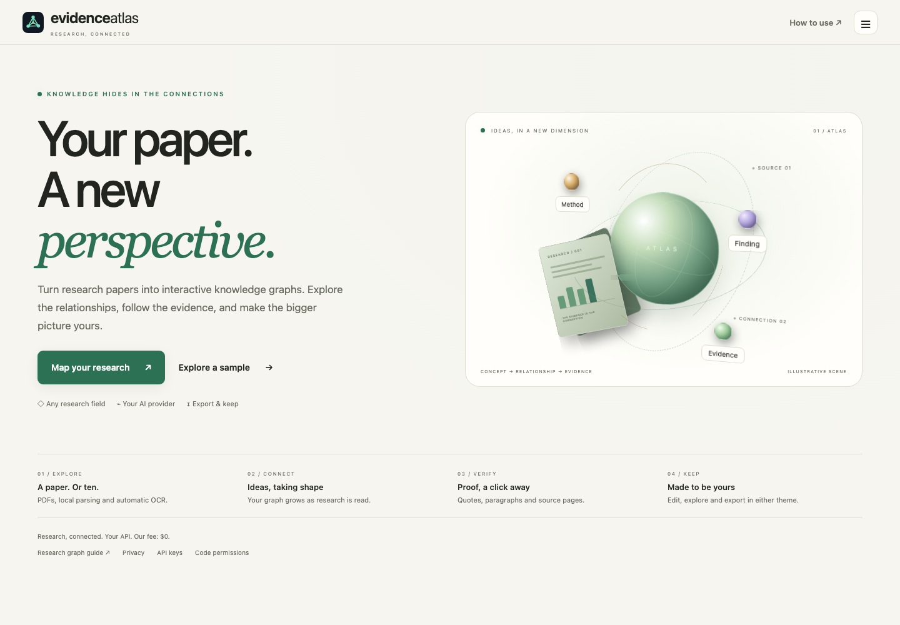
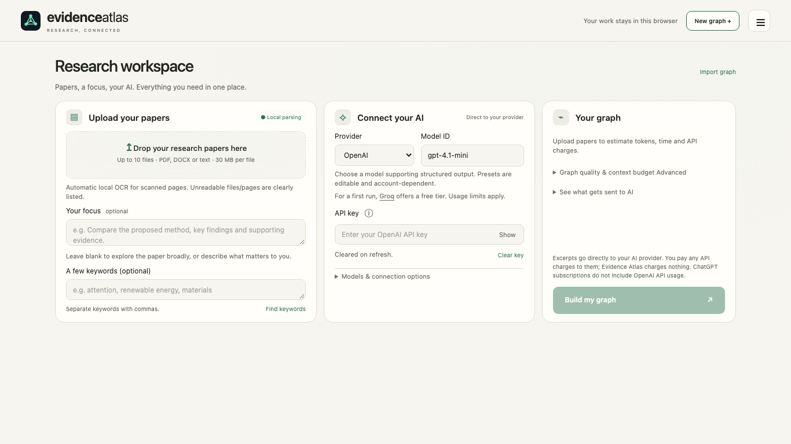
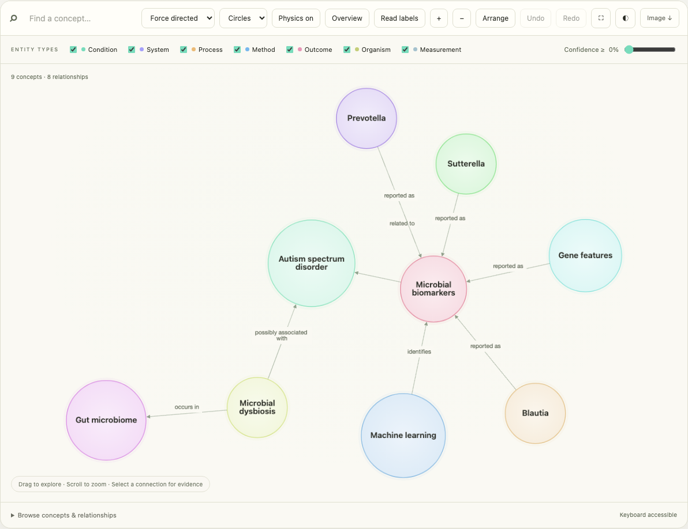
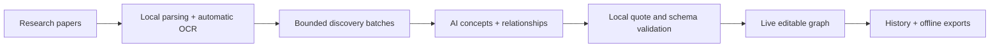

<p align="center">
  
</p>
<h1 align="center">Evidence Atlas</h1>
<p align="center"><strong>Your paper. A new perspective.</strong></p>
<p align="center">Connect ideas across research papers.<br>Follow every connection back to its evidence.</p>
<p align="center">
  Browser-first · Any research field · Your AI provider · Offline exports
</p>
<p align="center">
  <a href="https://evidence-atlas.netlify.app">Live website</a> ·
  <a href="https://evidence-atlas.netlify.app/guide/">Research graph guide</a> ·
  <a href="#the-workspace">Explore</a> ·
  <a href="#run-locally">Run locally</a> ·
  <a href="docs/TESTING.md">Verification</a> ·
  <a href="LICENSE">Code permissions</a>
</p>



**Evidence Atlas turns up to ten research papers into an editable knowledge graph.** Upload your documents, optionally describe what interests you, and connect your own AI provider—all in one workspace. Watch concepts and relationships arrive, inspect the original quotations, and keep a graph you can explore offline.

The extraction pipeline is **discipline neutral**: models, methods, materials, theories, measurements, findings and identifiers are discovered from the uploaded text. Biomedical examples are included as illustrations, not as a required ontology.

## The workspace



| Read                                         | Connect                                             | Verify                                  | Keep                               |
| :------------------------------------------- | :-------------------------------------------------- | :-------------------------------------- | :--------------------------------- |
| Up to **10 papers** per project              | Live concept and relationship updates               | Source document, paragraph and PDF page | Editable nodes and relationships   |
| Local parsing and automatic scanned-page OCR | Your provider, model and memory-only key            | Quotes checked against extracted text   | Circles or cards; optional physics |
| Optional focus and keywords                  | Estimated calls, tokens, duration and provider cost | Clear partial/excluded document reports | Offline HTML, JSON, PNG and SVG    |

The homepage and workspace are separate views. The workspace shows the complete setup together; there is no step wizard. On standard desktop viewports, the homepage and initial setup fit at 100% zoom. Smaller screens keep readable controls with natural scrolling.

**Your work stays with you.** Returning to the homepage or opening the sample keeps the active analysis running. New graph saves the previous project first. The ☰ menu contains paginated History and theme controls; unfinished projects are marked **Ongoing**. Refresh preserves saved checkpoints but clears your API key.

## Graphs with room to think



Distinct colors, softly shaded nodes, complete wrapped labels and collision separation make the graph easier to read. Choose circles or cards; drag nodes, switch layouts, search, filter, zoom, or use fullscreen. Optional damped physics briefly settles nearby nodes after a drag.

Click a node or relationship to inspect its source. Change a concept’s name, category or color; edit a relationship; delete a node; undo or redo your edits. Original evidence remains attached and edits are marked. Exported HTML bundles the same editable viewer and makes **no network requests**.

<details>
<summary><strong>See the light theme</strong></summary>







</details>

The included nine-node sample is **manually curated and illustrative**. It is not presented as a live AI result. Measured live Groq results and comparisons with the original HTML graphs are recorded separately in [the evaluation report](docs/LIVE_GROQ_ANALYSIS.md).

## Your AI, a clear estimate

| Provider          | Connection                                                |
| :---------------- | :-------------------------------------------------------- |
| OpenAI            | Direct API requests with structured output                |
| Anthropic Claude  | Direct Messages API with native JSON schema output        |
| Google Gemini     | Direct generation with a response schema                  |
| Groq              | Direct OpenAI-compatible API with recommended presets     |
| OpenAI-compatible | Your trusted endpoint and model; browser CORS is required |

For a first run, [Groq offers a free tier](https://console.groq.com/docs/rate-limits), subject to account and model limits. **GPT-OSS 20B** is a suggested starting model; presets remain editable. Cerebras has no dedicated picker or free-access claim; a trusted compatible endpoint can still be entered.

Before building, see approximate **calls, tokens, time and API cost**. Long quota waits show calculated OpenAI and Gemini alternatives; expand the comparison for calls, charges and assumptions. Optional dashboard limits make the estimate match your project. See [current models, pricing and quotas](docs/PROVIDER-AUDIT.md) and [provider timing](docs/PROVIDER-TIMING.md). During analysis, see actual progress, pacing waits and provider-reported usage. At completion, inspect the token and estimated-cost receipt. Unknown prices or missing usage remain unknown.

**Evidence Atlas charges $0.** Any API charges belong to your provider; a ChatGPT subscription does not include OpenAI API usage. Free-plan cost estimates apply only when the selected account is eligible and stays within its quota. The provider’s billing record is authoritative.

Requests run serially. Conservative minute/day budgets reserve estimated input plus maximum output (Gemini TPM reserves input only); reported usage and readable quota headers refine the budget. OpenAI presets use published Tier 1 rates with 20% headroom; Gemini and Claude use clearly labeled app pacing examples until you enter dashboard limits; no universal daily quota is invented. Rejected keys are blocked, rate limits trigger cooldowns, and generation errors are not retried automatically. Large collections may require multiple quota windows, which appear in the estimate. Other tabs, applications and account usage remain outside the app’s view. See [request pacing and accounting](docs/MULTI-PAPER-WORKFLOW.md).

## Privacy by design

- **Local:** parsing, OCR, layouts, editing, quote validation, history and exports.
- **Sent to your AI provider:** selected document excerpts and concept context when you start analysis. No intermediate application backend.
- **API key:** this tab’s memory only. Never localStorage, sessionStorage, IndexedDB, history or exports. Refresh clears it. The key information button explains this briefly.
- **Saved history:** parsed text, source paragraphs, graph data, checkpoints and non-secret settings in IndexedDB. Original uploaded files are not saved. Use exports for durable backups.
- **Automatic OCR:** page images stay local. English language data downloads on demand; the static host may record ordinary access logs.

Files support PDF, DOCX, TXT, Markdown, CSV and TSV; text formats are treated as text. Limits are **10 files**, **30 MB per file**, and **500 pages per PDF**. Unreadable files/pages are listed explicitly and excluded from evidence; other readable content continues.

**Live:** [evidence-atlas.netlify.app](https://evidence-atlas.netlify.app/) · [PDF-to-graph guide](https://evidence-atlas.netlify.app/guide/)

Push application changes to `main` to redeploy automatically after Netlify’s tests and build succeed. GitHub Actions also checks formatting, unit tests, SEO and the workspace. Documentation-only pushes skip a production deployment. See [deployment details](docs/DEPLOYMENT.md) and [search indexing](docs/SEO.md).

## Run locally

Use **Node.js 22.12+** and npm:

```sh
npm ci
npm run dev
```

Open the localhost URL printed by Vite. No backend, account, database or `.env` file is required. Exploring the sample uses no API key or AI calls; add your key in the workspace to analyze documents.

```sh
npm run check                     # TypeScript
npm test                          # Deterministic unit tests
npx playwright install chromium
npm run test:e2e                  # Browser workflows with controlled AI responses
npm run build                    # Production app in dist/
npm run preview                  # Serve the production build
npm run format:check
```

Deploy the **contents of `dist/`** to a static HTTPS host. Assets use relative paths. The root `index.html` is a Vite entry point; do not publish the unbuilt source as the app. Main-app parsing needs a web server; exported graph HTML opens directly from disk. Builds include application terms and runtime dependency notices under `dist/licenses/`.

## How it works



The model identifies concepts and relationships. It does **not** generate HTML, draw the graph, compute layouts, or manage source references. Discovery traverses parsed body passages in bounded batches; compact extraction requests use stable locally assigned node IDs. Per-paper passage IDs keep quotations and page indices distinct across a collection. Grounded concepts remain visible even when no supported relationship connects them.

| Directory        | Responsibility                                         |
| :--------------- | :----------------------------------------------------- |
| `src/documents/` | Local parsing, OCR and per-file manifests              |
| `src/retrieval/` | Matching, bounded context, coverage and budgets        |
| `src/providers/` | Prompts, REST adapters, pacing, prices and usage       |
| `src/graph/`     | Validation, rendering, editing and exports             |
| `src/storage/`   | IndexedDB history and resumable drafts                 |
| `src/ui/`        | Homepage, unified workspace, themes and dialogs        |
| `tests/`         | Unit and browser checks                                |
| `docs/`          | Evaluation reports, verification and screenshots       |
| `legacy/`        | The original site and condition-specific HTML examples |

Vanilla TypeScript and Vite; four core runtime libraries: **Cytoscape.js, PDF.js, Mammoth and Tesseract.js**. Heavy parsing/OCR/viewer modules load on demand. No embedding service, vector database or provider SDK is required. Read [the architectural decisions](docs/RESEARCH.md).

## Verified, with honest limits

The current suite covers **109 unit tests** and **42 browser scenarios**, including ten actual PDFs together (287 pages), automatic OCR of the uploaded scanned paper, offline exports, graph spacing/physics, draft recovery, live navigation and both themes. Desktop fit checks cover 1440×900, 1366×768 and 1280×720 at normal zoom; mobile checks cover horizontal containment and reduced motion.

Automated AI responses are intercepted fixtures; they verify implementation behavior, not live semantic accuracy. Earlier user-authorized real Groq testing is documented separately. A valid quotation proves text provenance, **not scientific truth or correct interpretation**. Whole-paper traversal cannot guarantee that an LLM identifies every important node. Review the graph against the paper, especially when OCR, inference or ambiguous findings are involved.

- [Verification and reproduction](docs/TESTING.md)
- [Public-paper corpus and sources](docs/ONLINE-PAPER-TESTING.md)
- [Live Groq results and original graph comparison](docs/LIVE_GROQ_ANALYSIS.md)
- [Multi-paper processing, estimates and recovery](docs/MULTI-PAPER-WORKFLOW.md)
- [Workspace and visual redesign report](docs/WORKSPACE-REDESIGN.md)

## Original examples and code permissions

The original repository history is retained. All **31 original tracked files** were preserved byte for byte under [`legacy/`](legacy/README.md), including azoospermia, oligospermia and the other condition-specific graphs. The app now lives at the repository root; the legacy graphs remain available for comparison.

**Original code reuse requires prior written permission from Ronit Gandotra.** This is a source-available project under custom permission-required terms, not an MIT license. Using the hosted application and sharing generated graph exports are permitted under the stated exception. Dependencies and third-party content retain their own licenses and rights.

Read [LICENSE](LICENSE), [third-party notices](THIRD-PARTY-NOTICES.md), and the [unsigned permission-record template](docs/CODE-USE-PERMISSION.md). To request approval, contact the [repository maintainer](https://github.com/RonitGandotra05/Knowledge-Graph-Generator-Using-Generative-AI) with your intended use and distribution.

### Personal graph editing

The graph editor includes a collapsible **Customize** panel for overall scale, node size, node and connection fonts, desired connection spacing, and connection-label visibility. Compact and Comfortable presets keep these settings coordinated. All five layouts use measured node bounds to keep labels inside separate nodes; concentric spacing can shrink to zero. Connection labels sit on their actual curves; collision avoidance reroutes the line through its text instead of moving the text away. Overall size reaches 10%, node size 15%, and both font controls reach 4 px. Nodes retain enough room for their words. **Read labels** zooms into tiny graphs without changing their saved sizes. Physics uses the same spacing target as the initial layout and preserves radial, hierarchical and grid arrangements.

Use **+ Concept** to add ideas with personal notes. **Edit concept** includes a connection list; open a connection to change its endpoints or description, or delete it. **+ Connection** creates a directed relationship between two concepts, clearly marked as a personal connection without paper evidence. **Select multiple** supports clicks, a selection box and the keyboard-accessible concept list; Shift-click selects directly. Batch deletions cascade to connections and can be undone or redone.

The evidence inspector moves by dragging its header or using arrow keys while the header is focused. Appearance, notes and personal connections survive browser drafts, JSON import/export and interactive offline HTML exports. PNG and SVG use the chosen sizes, fonts, shapes and label visibility.
